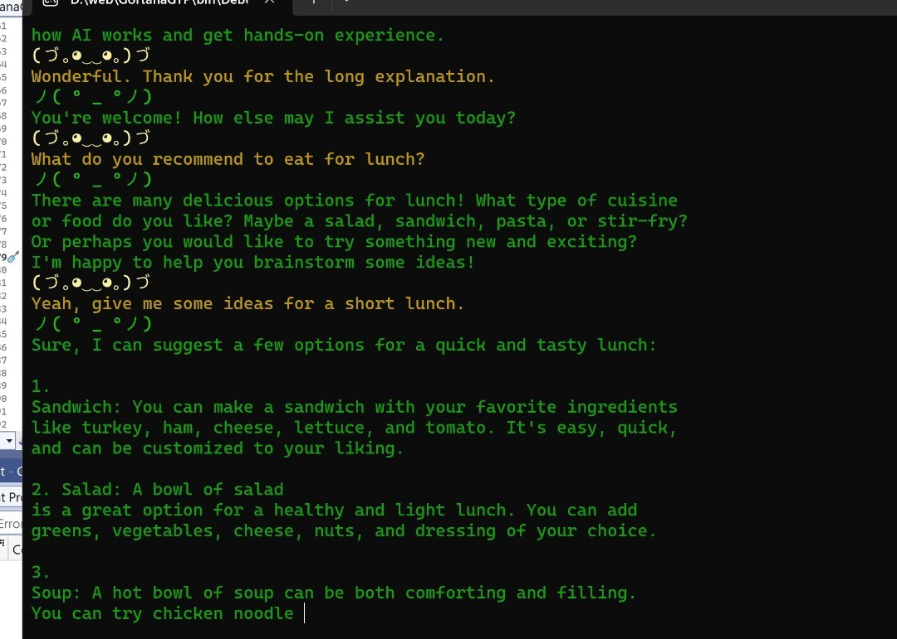

# Gortana GPT - Voice Chat Interface using Azure Cognitive Services and OpenAI ChatGPT

This project is a .NET 7.0 C# console application that utilizes Azure Cognitive Services and OpenAI ChatGPT to create a voice chat interface. 
With this project, you can have natural, voice-based conversations with a chatbot using your microphone.
 

## Features

Several features are integrated:  

 02.03.23 
- choose voice or text interaction
- reset conversation
- keep short time memory
- timeout reset if no voice interaction present 
- random avatars 
- typing & voice sync

## Tools Used

This project uses the following tools:

- .NET 7.0
- C#
- Azure Cognitive Services
- OpenAI ChatGPT API

## Resources

- [.NET 7.0](https://dotnet.microsoft.com/download/dotnet/7.0)
- [Visual Studio](https://visualstudio.microsoft.com/)
- [Azure Cognitive Services](https://azure.microsoft.com/en-us/services/cognitive-services/)
- [OpenAI ChatGPT API](https://beta.openai.com/docs/api-reference/chat/introduction)

## License

This project is licensed under the MIT License - see the [LICENSE](LICENSE) file for details.
